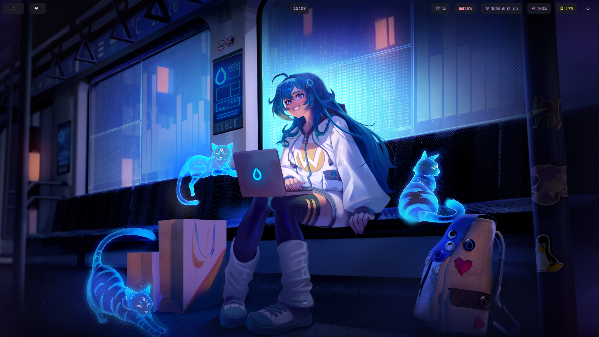

#  Hyprland Desktop Configuration

A minimal, elegant, and functional Hyprland desktop configuration with a purple-themed aesthetic for Linux.

##  Overview

This repository contains my personal Hyprland Wayland compositor configuration along with complementary tools to create a cohesive desktop environment.

### Components

- **[Hyprland](https://hyprland.org/)** - A dynamic tiling Wayland compositor
- **[Waybar](https://github.com/Alexays/Waybar)** - Highly customizable Wayland bar
- **[Hyprpaper](https://github.com/hyprwm/hyprpaper)** - Wallpaper utility for Hyprland
- **[Hyprlock](https://github.com/hyprwm/hyprlock)** - Lock screen utility for Hyprland
- **[Wofi](https://hg.sr.ht/~scoopta/wofi)** - Application launcher for Wayland
- **[Wlogout](https://github.com/ArtsyMacaw/wlogout)** - Logout menu for Wayland

## Dependencies

- Hyprland
- Waybar
- Hyprpaper
- Hyprlock
- Wofi
- Wlogout
- Kitty (terminal emulator)
- Firefox
- JetBrains Mono Nerd Font
- grim (screenshot utility)

## Installation

1. Clone this repository:
```bash
git clone https://github.com/yourusername/hypr-config.git
```

2. Create symbolic links to your config directory:
```bash
# Create necessary directories
mkdir -p ~/.config/{hypr,waybar,wofi,wlogout}

# Link configurations
ln -sf ~/path/to/repo/hypr/.config/hypr/* ~/.config/hypr/
ln -sf ~/path/to/repo/waybar/.config/waybar/* ~/.config/waybar/
ln -sf ~/path/to/repo/wofi/.config/wofi/* ~/.config/wofi/ 
ln -sf ~/path/to/repo/wlogout/.config/wlogout/* ~/.config/wlogout/
```

3. Install the JetBrains Mono Nerd Font:
```bash
# Method may vary depending on distribution
mkdir -p ~/.local/share/fonts
# Download the font and place it in the directory
fc-cache -f -v
```

4. Make sure you have the wallpaper image at:
```
~/Pictures/wallpapers/Kath.png
```

## Keybindings

| Keybinding | Action |
|------------|--------|
| `Super + Return` | Open terminal (kitty) |
| `Super + Q` | Close active window |
| `Super + F` | Open Firefox |
| `Super + Space` | Switch keyboard layout |
| `Super + D` | Open application launcher (wofi) |
| `Super + L` | Open logout menu (wlogout) |
| `Print` | Take screenshot (saved to ~/Pictures/Screenshots/) |
| `Super + 1-0` | Switch to workspace 1-10 |
| `Super + Shift + 1-0` | Move active window to workspace 1-10 |

##Theme

This configuration features a purple-themed color scheme with semi-transparent elements for a modern look. The theme is consistent across all components including the bar, application launcher, and logout menu.

### Color Palette

- Primary Purple: `#B39DDB`
- Secondary Purple: `#CE93D8`
- Pink Accent: `#F48FB1`
- Text: `#c0caf5`
- Background: `rgba(26, 27, 38, 0.85)`
- Active Border: `rgba(33ccffee)`

## Configuration Details

### Hyprland

The Hyprland configuration includes:
- Dual monitor setup
- Window gaps and rounded corners
- Semi-transparent windows (80%)
- Custom keybindings

### Waybar

The Waybar configuration includes modules for:
- Workspaces
- Active window
- Clock
- CPU usage
- Memory usage
- Network status
- Audio controls
- Battery status
- System logout button
- System tray

### Lock Screen

Hyprlock is configured with:
- Blurred background wallpaper
- Clock and date display
- Clean input field for password

### Application Launcher

Wofi is configured with:
- Matching purple theme
- Fast search functionality
- Clear typography

##  Customization

### Changing Wallpaper

1. Place your desired wallpaper in `~/Pictures/wallpapers/`
2. Update the path in:
   - `~/.config/hypr/hyprpaper.conf`
   - `~/.config/hypr/hyprlock.conf` (if you want it as lock screen background)

### Modifying Colors

- Waybar colors: Edit `~/.config/waybar/style.css`
- Wofi colors: Edit `~/.config/wofi/style.css`
- Wlogout colors: Edit `~/.config/wlogout/style.css`
- Hyprland border colors: Edit `~/.config/hypr/hyprland.conf`

## Screenshots




## Credits

- Fonts: [JetBrains Mono Nerd Font](https://www.nerdfonts.com/)
- Icons: System default and Nerd Font icons

## License

This configuration is available under the MIT License. Feel free to use, modify, and share!
